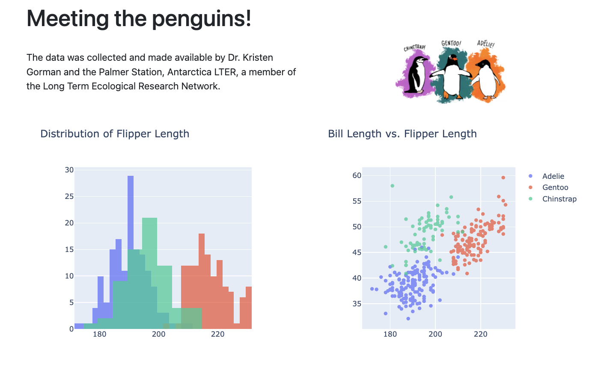

# demo-dash-penguins



<https://colorado.rstudio.com/rsc/demo-dash-penguins/>

# Usage

Create a new virtual environment:

```bash
python -m venv .venv
source .venv/bin/activate
pip install --upgrade pip wheel
pip install -r app/requirements.txt
```

The run the app:

```bash
python app/app.py
```

## Deployment

### Git-backed

The app is automatically deployed to RStudio connect using git backed deployment. Make any changes to the code, then run the following:

```bash
rsconnect write-manifest dash \
  --overwrite \
  --python .venv/bin/python \
  --entrypoint app \
  app
```

> ⚠️ Remember to update the app/requirements.txt file if you add any new packages.

### Programatic

You can deploy the app using the rsconnect cli:

```bash
rsconnect deploy dash \
  --python .venv/bin/python \
  --entrypoint app:app \
  --new \
  app
```